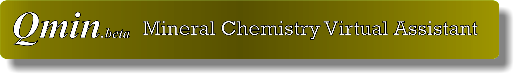

## Introduction

This is the Qmin - Mineral Chemistry Virtual Assistant. The models herein
presented perform mineral classification, missing value imputation by multivariate
regression and mineral formula prediction by several Random Forest classification 
and regression nested models.

The models have been developed by researchers of the Directory of Geology and Mineral
Resources, of the [Geological Survey of Brazil](https://www.cprm.gov.br/en/) (DGM/CPRM), with the assistance of
the technical manager of the EPMA laboratory of the [Institute of Geosciences/University of Brasília](http://www.igd.unb.br/) (IG/UnB).

## Important Notes

:warning: This model is in active development and so parameter names and
behaviors, and output file formats will change without notice.

:warning: The model is stochastic. Multiple runs with different seeds ([or random state](https://stackoverflow.com/questions/42191717/python-random-state-in-splitting-dataset))
should be undertaken to see average behavior.

:warning: The quality of the prediction is directly 
dependent on the quality of the entry data. Consider the best practice to input
data with the sum of elements concentration between 98-102%

:warning: At the current state, Qmin is able to predict among 17 groups and 188 different minerals.
Any other mineral not listed bellow will not perform as desired:

* AMPHIBOLES (29 minerals): Actinolite, Antophyllite, Arfvedsonite,
Barroisite, Cummingtonie, Eckermannite, Edenite, Fe-Ti-Tschermakite,
Fe-Tschermakite, Fe-Trschermakitic Hornblende, Ferrincnybite, Gedrite,
Glaucophane, Hastingsite, Kataphorite, Magnesio-Hastingsite, 
Magnesio-Hornblende, Magnesio-Arfvedsonite, Magnesio-Kataphorite,
Oxykaersutite, Pargasite, Richterite, Riebeckite, Ti-Mg-Hastingsite,
Tremolite, Tschermakite, Winchite.

* APATITE

* CARBONATES (31 minerals): Alstonite, Ancylite, Ankerite, Barytocalcite,
Breunnerite, Burbankite, Calcite, Carbocernaite, Cebaite, Cordylite,
Dolomite, Fluoro-Carbonate, Gregoryite, Huanghoite, Khanneshite,
Kukharenkoite, Kutnahorite, Magnesiosiderite, Magnesite, Mckelveyite,
Norsethite, Nyerereite, Olekminskite, Pirssonite, Qaqarssukite,
Rhodochrosite, Shortite, Siderite, Spurrite, Strontianite, Witherite

* CLAY-MINERALS (9 minerals): Beidellite, Corrensite, Illite, Kaolinite,
Montmorillonite, Nontronite, Palagonite, Saponite, Smectite

* FELDSPARS (10 minerals): Albite, Andesine, Anorthite, Anorthoclase, 
Bytownite, Labradorite, Microcline, Oligoclase, Orthoclase, Sanidine

* FELDSPATHOIDS (11 minerals): Analcime, Cancrinite, Hauyne, Kaliophilite,
Kalsilite, Leucite, Nepheline, Nosean, Pseudoleucite, Sodalite, Vishnevite

* GARNETS (8 minerals): Almandine, Andradite, Grossular, Hibschite,
Hydrogarnet, Melanite, Pyrope, Schorlomite

* ILMENITE

* MICAS (17 minerals): Annite, Biotite, Celadonite, Glauconite,
Hydromica, Hydromuscovite, Lepidolite, Margarite, Muscovite,
Paragonite, Phengite, Phengite-muscovite, Phlogopite, Sericite,
Siderophyllite, Yangzhumingite, Zinnwaldite

* OLIVINES (5 minerals): Fayalite, Forsterite, Iddingsite, Monticellite,
Ringwoodite

* PEROVSKITE

* PYROXENES (20 minerals): Acmite, Aegirine, Augite, Clinoenstatite
Cr-diopside, Diopside, Enstatite, Fassaite, Fe-diopside, Ferroaugite
Ferrohedenbergite, Ferropigeonite, Ferrosilite, Hedenbergite, Hypersthene
Jadeite, Omphacite, Pigeonite, Salite, Titan-augite

* QUARTZ

* SPINELS (11 minerals): Al-spinel, Chrome-spinel, Chromite, Fe-chromite,
Gahnite, Hercynite, Magnesioferrite, Magnetite, Pleonaste, Titano-magnetite,
Ulvospinel

* SULFIDES (31 minerals): Alabandite, Arsenopyrite, Bornite, Chalcocite, Chalcopyrite
Chlorbartonite, Cobaltite, Cubanite, Galena, Gersdorffite, Godlevskite,
Guanglinite, Heazlewoodite, Hexatestibiopanickelite, Hollingworthite,
Irarsite, Isocubanite, Linnaeite, Mackinawite, Maucherite, Merenskyite,
Molybdenite, Nickeline, Parkerite, Pentlandite, Polydymite, Pyrite, Pyrrhotite,
Rasvumite, Sphalerite, Stromeyerite.

* TITANITE

* ZIRCON

## Status

This model is in active development and subject to significant code changes
to:

* Increase the number of groups and minerals covered
* Improve performance
* Increase the size of samples used for training

## Training Data

The directory [data_raw](./data_raw) contains all raw data considered for the models' building. 
The main source of the data used for training is the [GEOROC](http://georoc.mpch-mainz.gwdg.de/georoc/) database.
The repository GEOROC is maintained by the Max Planck Institute for Chemistry in Mainz.

Some other data used in this work are a concession of researchers of the Geological Survey of Brazil 
and was used for the model's test and calibration. Those are available in the folder [OtherSources](./data_raw/OtherSources).

## Building:

Project Developed on R and Python3 languages.

The data wrangling, first missing value imputaion, convertion elements to oxides, and balancing
of mineral instances was done in R. The code is available in the [Code_R](./Code_R) folder. Some
Random Forest classification models are also available in the [model_r](./model_r) folder.

The final models used in this work were developed on Python3 language, and are available in the [model_py](./model_py) folder.
All python codes are available in the [Code_Python](./Code_Python) folder.

## Contributors

* [Guilherme Ferreira da Silva](http://buscatextual.cnpq.br/buscatextual/visualizacv.do?id=K4452179T4&idiomaExibicao=2), (E-mail: guilherme.ferreira@cprm.gov.br)
* [Marcos Vinícius Ferreira](http://buscatextual.cnpq.br/buscatextual/visualizacv.do?id=K4331039T8&idiomaExibicao=2), (E-mail: marcos.ferreira@cprm.gov.br)
* [Iago Sousa Lima Costa](http://buscatextual.cnpq.br/buscatextual/visualizacv.do?id=K4360736A0&idiomaExibicao=2), (E-mail: iago.costa@cprm.gov.br)
* [Renato Bernardes Borges](http://buscatextual.cnpq.br/buscatextual/visualizacv.do?id=K4272197D7&idiomaExibicao=2), (E-mail: renato.bernardes@unb.br)

## Copyright and License

The source code for Qmin is licensed under the MIT License, see [LICENSE](LICENSE).
